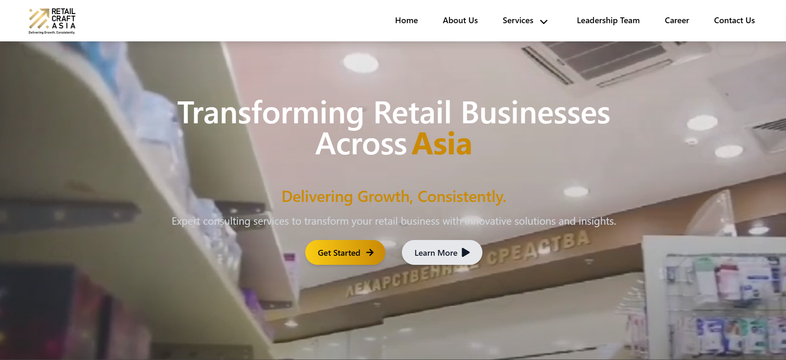

# RetailCraftAsia

A modern business website developed for **RetailCraftAsia**, focused on delivering a clean and responsive UI for showcasing services and collecting user inquiries. Built with **React.js** and **Tailwind CSS**, the site integrates seamlessly with **Google Sheets** to manage contact form submissions without requiring a backend.

🌐 Live Site: [retailcraftasia.com](http://retailcraftasia.com/)

## 🚀 Tech Stack

- **Frontend:** React.js
- **Styling:** Tailwind CSS
- **Form Integration:** Google Sheets (via Apps Script)

## 📌 Features

- ⚡ Fully responsive and mobile-friendly layout
- 🛠️ Built with modern frontend tools (React + Tailwind)
- 📨 Contact form submissions directly saved to Google Sheets
- ✨ Clean animations and smooth scroll
- 📄 SEO-friendly structure and performance-optimized

## 📷 Homepage Preview

## 🔗 Google Sheets Integration (Contact Form)

The contact form is linked to a Google Sheet using Google Apps Script. When a user submits the form:
1. Data is sent via `fetch()` from the frontend.
2. Google Apps Script captures the data.
3. Data is appended to a Google Sheet in real-time.

This avoids the need for any backend server or database for basic form handling.

## 💡 For Recruiters

This project demonstrates:

- Frontend architecture using React.js and Tailwind CSS
- No-backend form handling using Google Apps Script
- Clean UI/UX design and deployment-ready build
- Live deployment of a client-ready website

📂 **Portfolio:**  
👉 [https://pratik-paliwal.vercel.app/](https://pratik-paliwal.vercel.app/)

## 📬 Contact

To learn more about this project or request access to the codebase (private), feel free to reach out:

- 🔗 [LinkedIn](https://www.linkedin.com/in/pratikpaliwal/)
- 📧 pratikpaliwal355@gmail.com

---

